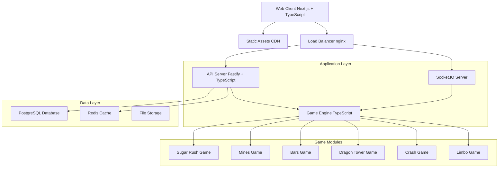

# 🎮 Yois Gaming Platform Architecture Plan
*Comprehensive Gaming Platform - Technical Specification*

**Project**: Yois Gaming Platform with Sugar Rush, Mines, Bars, Dragon Tower, Crash, and Limbo
**Date**: 2025-09-21
**Target**: Full-featured gaming platform with user management and social features

## 🏗️ Technology Stack (100% Free Tools)

### Frontend Stack
- **Framework**: Next.js 15 with React 19 (Latest stable, supports TypeScript natively)
- **Language**: TypeScript (Node.js 23 native support)
- **UI Components**: 
  - HeroUI (NextUI successor - modern, free component library)
  - Custom components from uiverse.io for unique game elements
  - Framer Motion for animations and transitions
- **State Management**: Zustand (lightweight, TypeScript-first)
- **Styling**: Tailwind CSS with custom game themes
- **Real-time**: Socket.IO client for live game updates

### Backend Stack
- **Runtime**: Node.js 23 (native TypeScript support)
- **Framework**: Fastify (fastest Node.js framework, better than Express)
- **Language**: TypeScript throughout
- **Real-time**: Socket.IO server for game state synchronization
- **Authentication**: Jose (JWT handling) + bcrypt for password hashing
- **Validation**: Zod for runtime type validation
- **File Upload**: Multer for avatar/media uploads

### Database & Data Layer
- **Primary DB**: PostgreSQL (free, robust, supports ACID transactions)
- **ORM**: Prisma (modern TypeScript-first ORM)
- **Caching**: Redis (for session management and game state caching)
- **Migrations**: Prisma migrations for version control

### Game Engine Architecture
- **Game Logic**: Custom TypeScript classes per game
- **Random Number Generation**: Crypto.randomUUID() + seedable PRNG
- **Game State**: Immutable state machines using Immer
- **Math Engine**: Custom provably fair algorithms
- **Animation**: Canvas API + requestAnimationFrame for smooth 60fps

### Development Tools
- **Build Tool**: Turbopack (built into Next.js 15)
- **Testing**: Vitest + React Testing Library + Playwright E2E
- **Linting**: ESLint + Prettier + TypeScript strict mode
- **Package Manager**: pnpm (faster than npm/yarn)
- **Git Hooks**: Husky + lint-staged

### DevOps & Deployment (User has own hosting)
- **Containerization**: Docker + Docker Compose for development
- **Process Manager**: PM2 for production process management
- **Monitoring**: Native Node.js diagnostics + custom logging
- **Environment**: dotenv-cli for environment management

## 🎯 System Architecture



## 📁 Project Structure

```
yois-gaming-platform/
├── apps/
│   ├── web/                          # Next.js frontend application
│   │   ├── src/
│   │   │   ├── app/                  # App router pages
│   │   │   │   ├── auth/            # Authentication pages
│   │   │   │   ├── games/           # Game pages
│   │   │   │   │   ├── sugar-rush/
│   │   │   │   │   ├── mines/
│   │   │   │   │   ├── bars/
│   │   │   │   │   ├── dragon-tower/
│   │   │   │   │   ├── crash/
│   │   │   │   │   └── limbo/
│   │   │   │   ├── profile/         # User profile pages
│   │   │   │   └── leaderboards/    # Social features
│   │   │   ├── components/          # React components
│   │   │   │   ├── ui/              # HeroUI + custom UI components
│   │   │   │   ├── games/           # Game-specific components
│   │   │   │   └── layout/          # Layout components
│   │   │   ├── hooks/               # Custom React hooks
│   │   │   ├── lib/                 # Utility functions
│   │   │   ├── stores/              # Zustand state stores
│   │   │   └── types/               # TypeScript type definitions
│   │   ├── public/                  # Static assets
│   │   └── package.json
│   │
│   └── api/                          # Fastify backend application
│       ├── src/
│       │   ├── routes/              # API route handlers
│       │   │   ├── auth/            # Authentication routes
│       │   │   ├── games/           # Game-specific routes
│       │   │   ├── users/           # User management routes
│       │   │   └── leaderboards/    # Social feature routes
│       │   ├── services/            # Business logic services
│       │   ├── middleware/          # Express middleware
│       │   ├── database/            # Database connection and models
│       │   ├── games/               # Game engine modules
│       │   │   ├── core/            # Shared game logic
│       │   │   ├── sugar-rush/      # Sugar Rush game engine
│       │   │   ├── mines/           # Mines game engine
│       │   │   ├── bars/            # Bars game engine
│       │   │   ├── dragon-tower/    # Dragon Tower game engine
│       │   │   ├── crash/           # Crash game engine
│       │   │   └── limbo/           # Limbo game engine
│       │   ├── socket/              # Socket.IO handlers
│       │   ├── utils/               # Utility functions
│       │   └── types/               # TypeScript type definitions
│       └── package.json
│
├── packages/                         # Shared packages
│   ├── shared-types/                # Shared TypeScript definitions
│   ├── game-engine/                 # Core game engine library
│   ├── ui-components/               # Shared UI components
│   └── utils/                       # Shared utility functions
│
├── tests/                           # Test suites
│   ├── unit/                       # Unit tests
│   ├── integration/                # Integration tests
│   └── e2e/                        # End-to-end tests (Playwright)
│
├── docs/                           # Documentation
│   ├── api/                        # API documentation
│   ├── games/                      # Game mechanics documentation
│   └── deployment/                 # Deployment guides
│
├── docker/                         # Docker configuration
│   ├── development/                # Development containers
│   └── production/                 # Production containers
│
├── scripts/                        # Build and deployment scripts
├── .env.example                    # Environment variables template
├── docker-compose.yml              # Development environment
├── turbo.json                      # Turborepo configuration
├── package.json                    # Root package.json
└── README.md
```

## 🗄️ Database Schema Design

### Core Tables

```sql
-- Users and Authentication
CREATE TABLE users (
    id UUID PRIMARY KEY DEFAULT gen_random_uuid(),
    username VARCHAR(50) UNIQUE NOT NULL,
    email VARCHAR(255) UNIQUE NOT NULL,
    password_hash VARCHAR(255) NOT NULL,
    avatar_url VARCHAR(500),
    balance DECIMAL(15,2) DEFAULT 0.00,
    level INTEGER DEFAULT 1,
    experience_points INTEGER DEFAULT 0,
    created_at TIMESTAMP DEFAULT CURRENT_TIMESTAMP,
    updated_at TIMESTAMP DEFAULT CURRENT_TIMESTAMP,
    last_login_at TIMESTAMP,
    is_active BOOLEAN DEFAULT true
);

-- Game Sessions and History
CREATE TABLE game_sessions (
    id UUID PRIMARY KEY DEFAULT gen_random_uuid(),
    user_id UUID REFERENCES users(id),
    game_type VARCHAR(50) NOT NULL, -- 'sugar-rush', 'mines', etc.
    bet_amount DECIMAL(10,2) NOT NULL,
    payout DECIMAL(10,2) DEFAULT 0.00,
    profit_loss DECIMAL(10,2) NOT NULL, -- calculated field
    game_data JSONB NOT NULL, -- game-specific data
    multiplier DECIMAL(8,4),
    seed VARCHAR(255) NOT NULL, -- for provably fair
    is_completed BOOLEAN DEFAULT false,
    created_at TIMESTAMP DEFAULT CURRENT_TIMESTAMP,
    completed_at TIMESTAMP
);

-- Transactions (Balance Changes)
CREATE TABLE transactions (
    id UUID PRIMARY KEY DEFAULT gen_random_uuid(),
    user_id UUID REFERENCES users(id),
    session_id UUID REFERENCES game_sessions(id),
    type VARCHAR(20) NOT NULL, -- 'bet', 'win', 'deposit', 'withdrawal'
    amount DECIMAL(10,2) NOT NULL,
    balance_after DECIMAL(15,2) NOT NULL,
    description TEXT,
    created_at TIMESTAMP DEFAULT CURRENT_TIMESTAMP
);

-- Leaderboards and Statistics
CREATE TABLE user_stats (
    id UUID PRIMARY KEY DEFAULT gen_random_uuid(),
    user_id UUID REFERENCES users(id) UNIQUE,
    total_bets INTEGER DEFAULT 0,
    total_wagered DECIMAL(15,2) DEFAULT 0.00,
    total_won DECIMAL(15,2) DEFAULT 0.00,
    net_profit DECIMAL(15,2) DEFAULT 0.00,
    biggest_win DECIMAL(10,2) DEFAULT 0.00,
    win_streak INTEGER DEFAULT 0,
    current_streak INTEGER DEFAULT 0,
    updated_at TIMESTAMP DEFAULT CURRENT_TIMESTAMP
);

-- Social Features
CREATE TABLE user_achievements (
    id UUID PRIMARY KEY DEFAULT gen_random_uuid(),
    user_id UUID REFERENCES users(id),
    achievement_type VARCHAR(50) NOT NULL,
    achievement_data JSONB,
    earned_at TIMESTAMP DEFAULT CURRENT_TIMESTAMP
);
```

### Game-Specific Data Structures

Each game stores its specific data in the `game_data` JSONB field with standardized structures:

- **Sugar Rush**: Grid selections, multipliers, cascade data
- **Mines**: Grid size, mine positions, revealed cells
- **Bars**: Reel positions, payline combinations
- **Dragon Tower**: Tower height, difficulty, path taken
- **Crash**: Cash-out point, multiplier curve data
- **Limbo**: Target multiplier, dice roll result

## 🎮 Game Architecture Patterns

### Core Game Engine Interface

```typescript
interface GameEngine<T extends GameConfig> {
  validateBet(bet: BetInput): ValidationResult;
  initializeGame(config: T, seed: string): GameState;
  processAction(state: GameState, action: GameAction): GameResult;
  calculatePayout(state: GameState): PayoutResult;
  isGameComplete(state: GameState): boolean;
  getProvablyFairData(state: GameState): ProvablyFairData;
}
```

### Provably Fair Implementation

Each game implements cryptographically verifiable randomness:
- Server seed (hidden until game completion)
- Client seed (chosen by player)
- Nonce (incremental counter)
- SHA-256 hashing for result generation

## 🔒 Security Implementation

### Authentication & Authorization
- JWT tokens with short expiry (15 minutes) + refresh tokens
- Rate limiting on all endpoints (express-rate-limit)
- Input validation with Zod schemas
- SQL injection prevention via Prisma ORM
- XSS protection with helmet.js

### Financial Security
- Double-entry bookkeeping for all transactions
- Atomic database operations for balance changes
- Audit trail for all financial operations
- Balance verification checksums

### Game Security
- Server-side game logic validation
- Provably fair random number generation
- Anti-cheat measures in game engines
- Session-based game state protection

## 🚀 Performance Optimization

### Frontend Optimization
- Next.js 15 with Turbopack for fast builds
- Code splitting at route and component level
- Canvas-based game rendering for smooth 60fps
- Service Workers for offline game rules
- Image optimization with Next.js Image component

### Backend Optimization
- Fastify instead of Express (20% faster)
- Connection pooling for PostgreSQL
- Redis caching for user sessions and leaderboards
- Database indexing on frequently queried fields
- Compression middleware for API responses

### Database Optimization
- Strategic indexes on user_id, game_type, created_at
- Partitioning on large tables (game_sessions, transactions)
- Read replicas for analytics and leaderboards
- Query optimization with EXPLAIN ANALYZE

## 📊 Monitoring & Analytics

### Application Monitoring
- Custom logging with Winston + structured JSON
- Error tracking with native Node.js diagnostics
- Performance metrics collection
- Real-time dashboards for game statistics

### Game Analytics
- Player behavior tracking
- Game performance metrics (RTP, volatility)
- Popular game identification
- User retention analytics

## 🧪 Testing Strategy

### Test Structure
```
tests/
├── unit/
│   ├── games/           # Game engine unit tests
│   ├── services/        # Business logic tests
│   └── utils/           # Utility function tests
├── integration/
│   ├── api/             # API endpoint tests
│   └── database/        # Database operation tests
└── e2e/
    ├── auth/            # Authentication flows
    ├── games/           # Complete game play tests
    └── social/          # Social feature tests
```

### Test Coverage Requirements
- **Unit Tests**: 90%+ coverage for game engines and core logic
- **Integration Tests**: All API endpoints and database operations
- **E2E Tests**: Critical user journeys and game completion flows

## 🔄 Development Methodology

### Development Phases
1. **Phase 1**: Core infrastructure and authentication
2. **Phase 2**: Game engine framework and one simple game (Mines)
3. **Phase 3**: Complete all 6 games with individual testing
4. **Phase 4**: Social features and leaderboards
5. **Phase 5**: Performance optimization and scaling
6. **Phase 6**: Advanced features and polish

### Code Quality Standards
- TypeScript strict mode enabled
- ESLint + Prettier for code formatting
- Husky pre-commit hooks for linting and testing
- Code review requirements for all game logic
- Modular architecture with maximum 500 lines per file

### Git Workflow
- Feature branches with descriptive names
- Conventional commit messages
- Squash merging for clean history
- Automated testing on all pull requests

## 🎨 UI/UX Framework Decisions

### Design System
- **Primary**: HeroUI for consistent components
- **Animations**: Framer Motion for smooth transitions
- **Custom Elements**: uiverse.io components for unique game features
- **Theming**: Dark-first design with neon accents
- **Typography**: Modern sans-serif with gaming aesthetics

### Responsive Design
- Mobile-first approach
- Touch-optimized game controls
- Progressive enhancement for desktop features
- Consistent spacing and sizing across devices

## 📈 Scalability Considerations

### Horizontal Scaling
- Stateless API servers for load balancing
- Redis for shared session storage
- Database connection pooling
- CDN for static assets

### Vertical Optimization
- Efficient algorithms for game calculations
- Memory pool management for game states
- Lazy loading for game assets
- Optimized database queries

---

*This document serves as the foundation for all development decisions. Any changes to the architecture must be documented here and communicated to the development team.*