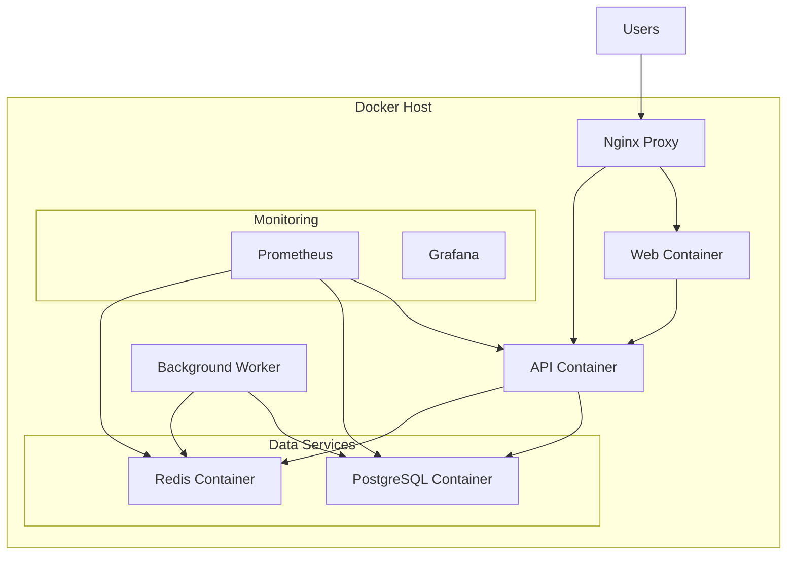

# 🐳 Docker Production Deployment

**Gaming Platform - Production Docker Containerization**

This guide covers containerizing and deploying the gaming platform using Docker and Docker Compose in production environments.

## 📋 Overview

### Container Architecture


## 🏗️ Production Dockerfiles

### Frontend (Web) Dockerfile
```dockerfile
# Multi-stage build for production optimization
FROM node:20-alpine AS builder

# Set working directory
WORKDIR /app

# Copy package files
COPY package*.json ./
COPY pnpm-lock.yaml ./
COPY pnpm-workspace.yaml ./

# Install pnpm
RUN npm install -g pnpm@8

# Copy workspace packages
COPY packages/ packages/
COPY apps/web/ apps/web/

# Install dependencies
RUN pnpm install --frozen-lockfile

# Build the application
RUN pnpm run build:web

# Production image
FROM node:20-alpine AS production

# Create non-root user
RUN addgroup -g 1001 -S nodejs
RUN adduser -S nextjs -u 1001

# Set working directory
WORKDIR /app

# Copy built application
COPY --from=builder --chown=nextjs:nodejs /app/apps/web/.next/standalone ./
COPY --from=builder --chown=nextjs:nodejs /app/apps/web/.next/static ./apps/web/.next/static
COPY --from=builder --chown=nextjs:nodejs /app/apps/web/public ./apps/web/public

# Switch to non-root user
USER nextjs

# Expose port
EXPOSE 3000

# Health check
HEALTHCHECK --interval=30s --timeout=10s --start-period=30s --retries=3 \
    CMD curl -f http://localhost:3000/api/health || exit 1

# Start application
CMD ["node", "apps/web/server.js"]
```

### Backend (API) Dockerfile
```dockerfile
# Multi-stage build
FROM node:20-alpine AS builder

WORKDIR /app

# Copy package files
COPY package*.json ./
COPY pnpm-lock.yaml ./
COPY pnpm-workspace.yaml ./

# Install pnpm
RUN npm install -g pnpm@8

# Copy source code
COPY packages/ packages/
COPY apps/api/ apps/api/

# Install dependencies
RUN pnpm install --frozen-lockfile

# Build the application
RUN pnpm run build:api

# Production image
FROM node:20-alpine AS production

# Install curl for health checks
RUN apk --no-cache add curl

# Create non-root user
RUN addgroup -g 1001 -S nodejs
RUN adduser -S apiuser -u 1001 -G nodejs

WORKDIR /app

# Copy built application
COPY --from=builder --chown=apiuser:nodejs /app/dist ./dist
COPY --from=builder --chown=apiuser:nodejs /app/node_modules ./node_modules
COPY --from=builder --chown=apiuser:nodejs /app/package.json ./package.json

# Switch to non-root user
USER apiuser

# Expose port
EXPOSE 3001

# Health check
HEALTHCHECK --interval=30s --timeout=10s --start-period=60s --retries=3 \
    CMD curl -f http://localhost:3001/health || exit 1

# Start application
CMD ["node", "dist/server.js"]
```

### Nginx Reverse Proxy Dockerfile
```dockerfile
FROM nginx:alpine

# Install certbot for SSL
RUN apk add --no-cache certbot certbot-nginx

# Copy nginx configuration
COPY docker/nginx/nginx.conf /etc/nginx/nginx.conf
COPY docker/nginx/default.conf /etc/nginx/conf.d/default.conf

# Copy SSL scripts
COPY docker/nginx/ssl-setup.sh /usr/local/bin/ssl-setup.sh
RUN chmod +x /usr/local/bin/ssl-setup.sh

# Expose ports
EXPOSE 80 443

# Health check
HEALTHCHECK --interval=30s --timeout=10s --start-period=30s --retries=3 \
    CMD curl -f http://localhost/health || exit 1

CMD ["nginx", "-g", "daemon off;"]
```

## ⚙️ Production Docker Compose

### docker-compose.prod.yml
```yaml
version: '3.8'

services:
  nginx:
    build:
      context: .
      dockerfile: docker/nginx/Dockerfile
    container_name: gaming-nginx
    ports:
      - "80:80"
      - "443:443"
    volumes:
      - ./docker/nginx/nginx.conf:/etc/nginx/nginx.conf
      - ./docker/nginx/ssl:/etc/nginx/ssl
      - certbot-etc:/etc/letsencrypt
      - certbot-var:/var/lib/letsencrypt
    depends_on:
      - web
      - api
    networks:
      - gaming-network
    restart: unless-stopped
    environment:
      - DOMAIN=${DOMAIN}
      - EMAIL=${SSL_EMAIL}

  web:
    build:
      context: .
      dockerfile: docker/web/Dockerfile.prod
      target: production
    container_name: gaming-web
    expose:
      - "3000"
    environment:
      - NODE_ENV=production
      - NEXT_PUBLIC_API_URL=${API_URL}
      - NEXT_PUBLIC_WS_URL=${WS_URL}
    networks:
      - gaming-network
    restart: unless-stopped
    deploy:
      replicas: 2
      resources:
        limits:
          memory: 1G
          cpus: '0.5'
        reservations:
          memory: 512M
          cpus: '0.25'

  api:
    build:
      context: .
      dockerfile: docker/api/Dockerfile.prod
      target: production
    container_name: gaming-api
    expose:
      - "3001"
    environment:
      - NODE_ENV=production
      - DATABASE_URL=${DATABASE_URL}
      - REDIS_URL=${REDIS_URL}
      - JWT_SECRET=${JWT_SECRET}
      - JWT_REFRESH_SECRET=${JWT_REFRESH_SECRET}
    depends_on:
      - postgresql
      - redis
    networks:
      - gaming-network
    restart: unless-stopped
    deploy:
      replicas: 2
      resources:
        limits:
          memory: 2G
          cpus: '1.0'
        reservations:
          memory: 1G
          cpus: '0.5'

  postgresql:
    image: postgres:16-alpine
    container_name: gaming-postgresql
    environment:
      - POSTGRES_DB=${DB_NAME}
      - POSTGRES_USER=${DB_USER}
      - POSTGRES_PASSWORD=${DB_PASSWORD}
    volumes:
      - postgres-data:/var/lib/postgresql/data
      - ./docker/postgresql/init:/docker-entrypoint-initdb.d
      - ./docker/postgresql/postgresql.conf:/etc/postgresql/postgresql.conf
    ports:
      - "5432:5432"
    networks:
      - gaming-network
    restart: unless-stopped
    deploy:
      resources:
        limits:
          memory: 4G
          cpus: '2.0'
        reservations:
          memory: 2G
          cpus: '1.0'
    healthcheck:
      test: ["CMD-SHELL", "pg_isready -U ${DB_USER} -d ${DB_NAME}"]
      interval: 30s
      timeout: 10s
      retries: 5

  redis:
    image: redis:7-alpine
    container_name: gaming-redis
    command: redis-server /etc/redis/redis.conf
    volumes:
      - redis-data:/data
      - ./docker/redis/redis.conf:/etc/redis/redis.conf
    ports:
      - "6379:6379"
    networks:
      - gaming-network
    restart: unless-stopped
    deploy:
      resources:
        limits:
          memory: 2G
          cpus: '1.0'
        reservations:
          memory: 1G
          cpus: '0.5'
    healthcheck:
      test: ["CMD", "redis-cli", "ping"]
      interval: 30s
      timeout: 10s
      retries: 5

  worker:
    build:
      context: .
      dockerfile: docker/worker/Dockerfile
    container_name: gaming-worker
    environment:
      - NODE_ENV=production
      - DATABASE_URL=${DATABASE_URL}
      - REDIS_URL=${REDIS_URL}
    depends_on:
      - postgresql
      - redis
    networks:
      - gaming-network
    restart: unless-stopped
    deploy:
      resources:
        limits:
          memory: 1G
          cpus: '0.5'
        reservations:
          memory: 512M
          cpus: '0.25'

  prometheus:
    image: prom/prometheus:latest
    container_name: gaming-prometheus
    command:
      - '--config.file=/etc/prometheus/prometheus.yml'
      - '--storage.tsdb.path=/prometheus'
      - '--web.console.libraries=/etc/prometheus/console_libraries'
      - '--web.console.templates=/etc/prometheus/consoles'
      - '--web.enable-lifecycle'
      - '--web.external-url=http://localhost:9090'
    volumes:
      - ./docker/monitoring/prometheus.yml:/etc/prometheus/prometheus.yml
      - prometheus-data:/prometheus
    ports:
      - "9090:9090"
    networks:
      - gaming-network
    restart: unless-stopped

  grafana:
    image: grafana/grafana:latest
    container_name: gaming-grafana
    environment:
      - GF_SECURITY_ADMIN_PASSWORD=${GRAFANA_PASSWORD}
    volumes:
      - grafana-data:/var/lib/grafana
      - ./docker/monitoring/grafana/dashboards:/etc/grafana/provisioning/dashboards
      - ./docker/monitoring/grafana/datasources:/etc/grafana/provisioning/datasources
    ports:
      - "3000:3000"
    networks:
      - gaming-network
    restart: unless-stopped

volumes:
  postgres-data:
    driver: local
  redis-data:
    driver: local
  prometheus-data:
    driver: local
  grafana-data:
    driver: local
  certbot-etc:
    driver: local
  certbot-var:
    driver: local

networks:
  gaming-network:
    driver: bridge
```

## 🔧 Nginx Configuration

### nginx.conf
```nginx
user nginx;
worker_processes auto;
error_log /var/log/nginx/error.log warn;
pid /var/run/nginx.pid;

events {
    worker_connections 1024;
    use epoll;
    multi_accept on;
}

http {
    include /etc/nginx/mime.types;
    default_type application/octet-stream;

    # Logging
    log_format main '$remote_addr - $remote_user [$time_local] "$request" '
                    '$status $body_bytes_sent "$http_referer" '
                    '"$http_user_agent" "$http_x_forwarded_for"';
    access_log /var/log/nginx/access.log main;

    # Performance
    sendfile on;
    tcp_nopush on;
    tcp_nodelay on;
    keepalive_timeout 65;
    types_hash_max_size 2048;
    client_max_body_size 20M;

    # Compression
    gzip on;
    gzip_vary on;
    gzip_min_length 1024;
    gzip_proxied any;
    gzip_comp_level 6;
    gzip_types text/plain text/css text/xml text/javascript 
               application/json application/javascript 
               application/xml+rss application/atom+xml 
               image/svg+xml;

    # Rate limiting
    limit_req_zone $binary_remote_addr zone=api:10m rate=100r/m;
    limit_req_zone $binary_remote_addr zone=login:10m rate=5r/m;

    # Upstream servers
    upstream web_backend {
        least_conn;
        server web:3000 max_fails=3 fail_timeout=30s;
    }

    upstream api_backend {
        least_conn;
        server api:3001 max_fails=3 fail_timeout=30s;
    }

    # Include server configurations
    include /etc/nginx/conf.d/*.conf;
}
```

### default.conf
```nginx
# HTTP to HTTPS redirect
server {
    listen 80;
    server_name _;
    return 301 https://$host$request_uri;
}

# HTTPS server
server {
    listen 443 ssl http2;
    server_name your-domain.com www.your-domain.com;

    # SSL Configuration
    ssl_certificate /etc/letsencrypt/live/your-domain.com/fullchain.pem;
    ssl_certificate_key /etc/letsencrypt/live/your-domain.com/privkey.pem;
    ssl_protocols TLSv1.2 TLSv1.3;
    ssl_ciphers ECDHE-RSA-AES256-GCM-SHA512:DHE-RSA-AES256-GCM-SHA512;
    ssl_prefer_server_ciphers off;
    ssl_session_cache shared:SSL:10m;
    ssl_session_timeout 10m;

    # Security headers
    add_header Strict-Transport-Security "max-age=63072000; includeSubDomains; preload";
    add_header X-Content-Type-Options nosniff;
    add_header X-Frame-Options SAMEORIGIN;
    add_header X-XSS-Protection "1; mode=block";
    add_header Referrer-Policy "strict-origin-when-cross-origin";

    # API routes
    location /api/ {
        limit_req zone=api burst=20 nodelay;
        
        proxy_pass http://api_backend;
        proxy_http_version 1.1;
        proxy_set_header Upgrade $http_upgrade;
        proxy_set_header Connection 'upgrade';
        proxy_set_header Host $host;
        proxy_set_header X-Real-IP $remote_addr;
        proxy_set_header X-Forwarded-For $proxy_add_x_forwarded_for;
        proxy_set_header X-Forwarded-Proto $scheme;
        proxy_cache_bypass $http_upgrade;
        
        # Timeouts
        proxy_connect_timeout 60s;
        proxy_send_timeout 60s;
        proxy_read_timeout 60s;
    }

    # WebSocket routes
    location /ws/ {
        proxy_pass http://api_backend;
        proxy_http_version 1.1;
        proxy_set_header Upgrade $http_upgrade;
        proxy_set_header Connection "upgrade";
        proxy_set_header Host $host;
        proxy_set_header X-Real-IP $remote_addr;
        proxy_set_header X-Forwarded-For $proxy_add_x_forwarded_for;
        proxy_set_header X-Forwarded-Proto $scheme;
        proxy_read_timeout 86400;
    }

    # Authentication routes (stricter rate limiting)
    location ~ ^/(api/auth/login|api/auth/register) {
        limit_req zone=login burst=5 nodelay;
        
        proxy_pass http://api_backend;
        proxy_http_version 1.1;
        proxy_set_header Host $host;
        proxy_set_header X-Real-IP $remote_addr;
        proxy_set_header X-Forwarded-For $proxy_add_x_forwarded_for;
        proxy_set_header X-Forwarded-Proto $scheme;
    }

    # Static assets with caching
    location ~* \.(js|css|png|jpg|jpeg|gif|ico|svg|woff2?)$ {
        proxy_pass http://web_backend;
        expires 1y;
        add_header Cache-Control "public, immutable";
        add_header X-Content-Type-Options nosniff;
    }

    # Main application
    location / {
        proxy_pass http://web_backend;
        proxy_http_version 1.1;
        proxy_set_header Upgrade $http_upgrade;
        proxy_set_header Connection 'upgrade';
        proxy_set_header Host $host;
        proxy_set_header X-Real-IP $remote_addr;
        proxy_set_header X-Forwarded-For $proxy_add_x_forwarded_for;
        proxy_set_header X-Forwarded-Proto $scheme;
        proxy_cache_bypass $http_upgrade;
    }

    # Health check endpoint
    location /health {
        access_log off;
        return 200 "healthy\n";
        add_header Content-Type text/plain;
    }
}
```

## 🚀 Deployment Scripts

### deploy.sh
```bash
#!/bin/bash
set -e

# Production deployment script
echo "🚀 Starting production deployment..."

# Configuration
COMPOSE_FILE="docker-compose.prod.yml"
BACKUP_DIR="/opt/backups/gaming-platform"
DATE=$(date +%Y%m%d_%H%M%S)

# Create backup directory
mkdir -p $BACKUP_DIR

echo "📋 Pre-deployment checks..."

# Check if .env file exists
if [ ! -f .env ]; then
    echo "❌ .env file not found! Please create it from .env.example"
    exit 1
fi

# Check if Docker is running
if ! docker info >/dev/null 2>&1; then
    echo "❌ Docker is not running!"
    exit 1
fi

# Load environment variables
source .env

echo "💾 Creating database backup..."
docker-compose -f $COMPOSE_FILE exec -T postgresql pg_dump -U $DB_USER $DB_NAME > $BACKUP_DIR/db_backup_$DATE.sql

echo "🛑 Stopping existing containers..."
docker-compose -f $COMPOSE_FILE down

echo "📦 Pulling latest images..."
docker-compose -f $COMPOSE_FILE pull

echo "🏗️ Building application images..."
docker-compose -f $COMPOSE_FILE build --no-cache

echo "🚀 Starting containers..."
docker-compose -f $COMPOSE_FILE up -d

echo "⏳ Waiting for services to be ready..."
sleep 30

echo "🧪 Running health checks..."
./scripts/health-check.sh

echo "🗄️ Running database migrations..."
docker-compose -f $COMPOSE_FILE exec api npm run db:migrate

echo "✅ Deployment completed successfully!"
echo "🌐 Application should be available at https://$DOMAIN"
```

### health-check.sh
```bash
#!/bin/bash
set -e

# Health check script
echo "🧪 Running health checks..."

# Check web service
echo "Checking web service..."
if curl -f http://localhost/health >/dev/null 2>&1; then
    echo "✅ Web service is healthy"
else
    echo "❌ Web service is not responding"
    exit 1
fi

# Check API service
echo "Checking API service..."
if curl -f http://localhost/api/health >/dev/null 2>&1; then
    echo "✅ API service is healthy"
else
    echo "❌ API service is not responding"
    exit 1
fi

# Check database
echo "Checking database..."
if docker-compose exec -T postgresql pg_isready -U $DB_USER -d $DB_NAME >/dev/null 2>&1; then
    echo "✅ Database is healthy"
else
    echo "❌ Database is not responding"
    exit 1
fi

# Check Redis
echo "Checking Redis..."
if docker-compose exec -T redis redis-cli ping | grep -q PONG; then
    echo "✅ Redis is healthy"
else
    echo "❌ Redis is not responding"
    exit 1
fi

echo "✅ All services are healthy!"
```

## 🔄 Container Orchestration

### Docker Swarm Configuration
```yaml
# docker-stack.yml for Docker Swarm
version: '3.8'

services:
  nginx:
    image: gaming-platform/nginx:latest
    ports:
      - "80:80"
      - "443:443"
    deploy:
      replicas: 2
      placement:
        constraints:
          - node.role == manager
      update_config:
        parallelism: 1
        delay: 10s
      restart_policy:
        condition: on-failure

  web:
    image: gaming-platform/web:latest
    deploy:
      replicas: 4
      resources:
        limits:
          memory: 1G
          cpus: '0.5'
      update_config:
        parallelism: 2
        delay: 10s
      restart_policy:
        condition: on-failure

  api:
    image: gaming-platform/api:latest
    environment:
      - NODE_ENV=production
    secrets:
      - database_url
      - jwt_secret
    deploy:
      replicas: 4
      resources:
        limits:
          memory: 2G
          cpus: '1.0'
      update_config:
        parallelism: 1
        delay: 30s
      restart_policy:
        condition: on-failure

secrets:
  database_url:
    external: true
  jwt_secret:
    external: true

networks:
  gaming-network:
    driver: overlay
    attachable: true
```

## 📊 Monitoring Integration

### Prometheus Configuration
```yaml
# docker/monitoring/prometheus.yml
global:
  scrape_interval: 15s
  evaluation_interval: 15s

scrape_configs:
  - job_name: 'gaming-api'
    static_configs:
      - targets: ['api:3001']
    metrics_path: '/metrics'
    scrape_interval: 30s

  - job_name: 'postgresql'
    static_configs:
      - targets: ['postgresql:5432']
    
  - job_name: 'redis'
    static_configs:
      - targets: ['redis:6379']

  - job_name: 'nginx'
    static_configs:
      - targets: ['nginx:80']
```

## 🔒 Security Best Practices

### Container Security
- **Non-root users**: All containers run as non-root users
- **Read-only filesystems**: Where possible, use read-only containers
- **Security scanning**: Integrate container security scanning
- **Minimal base images**: Use Alpine Linux for smaller attack surface
- **Secret management**: Use Docker secrets for sensitive data

### Network Security
- **Private networks**: Isolate containers in private networks
- **Firewall rules**: Restrict container-to-container communication
- **SSL/TLS**: Encrypt all external communication
- **Rate limiting**: Implement rate limiting at proxy level

## 📋 Production Checklist

### Pre-Deployment
- [ ] Environment variables configured
- [ ] SSL certificates obtained
- [ ] Database backup created
- [ ] Docker images built and tested
- [ ] Health checks implemented
- [ ] Monitoring configured
- [ ] Log aggregation setup
- [ ] Security scan completed

### Post-Deployment
- [ ] All containers running
- [ ] Health checks passing
- [ ] SSL certificate valid
- [ ] Monitoring dashboards active
- [ ] Log ingestion working
- [ ] Performance benchmarks met
- [ ] Security headers verified
- [ ] Backup restoration tested

---

**Next Steps:**
- Configure [Cloud Deployment](./cloud-deployment.md)
- Set up [Database Production Setup](./database-setup.md)
- Implement [SSL Security](./ssl-security.md)
- Configure [Monitoring Setup](./monitoring-setup.md)