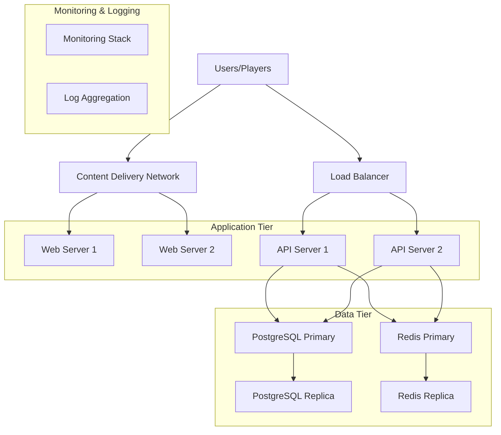

# 🏗️ Production Infrastructure Requirements

**Gaming Platform - Production Infrastructure Guide**

This document outlines the infrastructure requirements, recommendations, and architecture for deploying the gaming platform in a production environment.

## 🎯 Infrastructure Overview

### Architecture Components


## 💻 Server Requirements

### Minimum Production Setup (Small Scale)
**Expected Load**: 100-500 concurrent users

#### Application Servers (2 instances)
- **CPU**: 4 vCPUs (Intel/AMD equivalent)
- **RAM**: 8GB
- **Storage**: 100GB SSD
- **Network**: 1 Gbps
- **OS**: Ubuntu 22.04 LTS or CentOS Stream 9

#### Database Server
- **CPU**: 8 vCPUs
- **RAM**: 16GB
- **Storage**: 500GB SSD (NVMe preferred)
- **Network**: 10 Gbps
- **OS**: Ubuntu 22.04 LTS

#### Redis Cache Server
- **CPU**: 2 vCPUs
- **RAM**: 8GB
- **Storage**: 100GB SSD
- **Network**: 1 Gbps

### Recommended Production Setup (Medium Scale)
**Expected Load**: 500-2,000 concurrent users

#### Application Servers (3-4 instances)
- **CPU**: 8 vCPUs
- **RAM**: 16GB
- **Storage**: 200GB SSD
- **Network**: 10 Gbps

#### Database Server (Primary)
- **CPU**: 16 vCPUs
- **RAM**: 32GB
- **Storage**: 1TB NVMe SSD
- **Network**: 10 Gbps

#### Database Server (Read Replica)
- **CPU**: 8 vCPUs
- **RAM**: 16GB
- **Storage**: 1TB SSD
- **Network**: 10 Gbps

#### Redis Cluster (2-3 nodes)
- **CPU**: 4 vCPUs per node
- **RAM**: 16GB per node
- **Storage**: 200GB SSD per node
- **Network**: 10 Gbps

### High-Scale Production Setup (Large Scale)
**Expected Load**: 2,000+ concurrent users

#### Load Balancer
- **CPU**: 4 vCPUs
- **RAM**: 8GB
- **Network**: 25 Gbps
- **High Availability**: Active-Passive setup

#### Application Servers (6+ instances)
- **CPU**: 16 vCPUs
- **RAM**: 32GB
- **Storage**: 500GB NVMe SSD
- **Network**: 25 Gbps
- **Auto Scaling**: Enabled

#### Database Cluster
- **Primary**: 32 vCPUs, 64GB RAM, 2TB NVMe
- **Read Replicas**: 3x (16 vCPUs, 32GB RAM, 2TB SSD)
- **Connection Pooling**: PgBouncer
- **Backup Server**: Dedicated instance

#### Redis Cluster (6 nodes)
- **Master Nodes**: 3x (8 vCPUs, 32GB RAM)
- **Replica Nodes**: 3x (4 vCPUs, 16GB RAM)
- **Sentinel**: 3 instances for failover

## ☁️ Cloud Platform Recommendations

### AWS (Amazon Web Services)
**Recommended Services:**

#### Compute
- **EC2**: General Purpose (m6i.large to m6i.4xlarge)
- **Auto Scaling Groups**: For application servers
- **Elastic Load Balancer**: Application Load Balancer (ALB)

#### Database
- **RDS PostgreSQL**: Multi-AZ deployment
- **ElastiCache Redis**: Cluster mode enabled
- **Parameter Groups**: Optimized configurations

#### Storage
- **EBS**: GP3 volumes for application servers
- **EBS**: io2 volumes for database servers
- **S3**: Static assets and backups

#### Network
- **VPC**: Private subnets for databases
- **CloudFront**: CDN for static content
- **Route 53**: DNS management

#### Monitoring
- **CloudWatch**: Metrics and alarms
- **CloudTrail**: Audit logging
- **X-Ray**: Application tracing

#### Security
- **WAF**: Web Application Firewall
- **Security Groups**: Network-level security
- **IAM**: Access management
- **KMS**: Encryption key management

### Google Cloud Platform (GCP)
**Recommended Services:**

#### Compute
- **Compute Engine**: N2 standard instances
- **Managed Instance Groups**: Auto scaling
- **Cloud Load Balancing**: HTTP(S) load balancer

#### Database
- **Cloud SQL PostgreSQL**: High availability
- **Memorystore Redis**: Managed Redis
- **Cloud Storage**: Backup and static files

#### Network
- **VPC**: Private networking
- **Cloud CDN**: Content delivery
- **Cloud DNS**: DNS management

#### Monitoring
- **Cloud Monitoring**: Metrics and alerting
- **Cloud Logging**: Centralized logging
- **Cloud Trace**: Distributed tracing

### Microsoft Azure
**Recommended Services:**

#### Compute
- **Virtual Machines**: Standard D-series
- **Virtual Machine Scale Sets**: Auto scaling
- **Load Balancer**: Standard SKU

#### Database
- **Azure Database for PostgreSQL**: Flexible Server
- **Azure Cache for Redis**: Premium tier
- **Azure Storage**: Blob storage for assets

#### Network
- **Virtual Network**: Private subnets
- **Azure CDN**: Content delivery
- **Azure DNS**: DNS management

#### Monitoring
- **Azure Monitor**: Comprehensive monitoring
- **Log Analytics**: Log aggregation
- **Application Insights**: APM

## 🌐 Network Architecture

### Security Zones
```
Internet
    ↓
[WAF/DDoS Protection]
    ↓
[Public Subnet - Load Balancer]
    ↓
[Private Subnet - Application Servers]
    ↓
[Private Subnet - Database Servers]
```

### Network Security
- **Public Subnet**: Load balancers only
- **Private Subnets**: Application and database servers
- **Security Groups**: Restrictive inbound rules
- **NACLs**: Additional network-level protection
- **VPN**: Secure administrative access

### Load Balancing Strategy
- **Layer 7 Load Balancing**: HTTP/HTTPS routing
- **Health Checks**: Application-level health monitoring
- **SSL Termination**: At load balancer level
- **Session Affinity**: Disabled (stateless applications)
- **Auto Scaling**: Based on CPU and response time

## 🗄️ Database Architecture

### PostgreSQL Configuration
```sql
-- Production PostgreSQL Settings
-- postgresql.conf optimizations

# Memory Settings
shared_buffers = '25% of RAM'
effective_cache_size = '75% of RAM'
work_mem = '256MB'
maintenance_work_mem = '2GB'

# Connection Settings
max_connections = 200
max_prepared_transactions = 200

# Write-Ahead Logging
wal_buffers = '16MB'
checkpoint_segments = 64
checkpoint_completion_target = 0.9

# Query Planner
random_page_cost = 1.1
effective_io_concurrency = 200
```

### Redis Configuration
```conf
# Production Redis Configuration
# redis.conf optimizations

# Memory Management
maxmemory 4gb
maxmemory-policy allkeys-lru

# Persistence
save 900 1
save 300 10
save 60 10000

# Networking
tcp-keepalive 300
timeout 300

# Security
requirepass your-redis-password
rename-command FLUSHALL ""
rename-command CONFIG "CONFIG_b83f8d2c1a5e"
```

## 📊 Monitoring Requirements

### Key Metrics to Monitor
#### Application Metrics
- **Request Rate**: Requests per second
- **Response Time**: 95th percentile latency
- **Error Rate**: 4xx/5xx error percentage
- **CPU Usage**: Per server instance
- **Memory Usage**: Heap and system memory
- **Active Connections**: WebSocket connections

#### Database Metrics
- **Connection Count**: Active connections
- **Query Performance**: Slow query log
- **Replication Lag**: Replica delay
- **Cache Hit Ratio**: Buffer cache efficiency
- **Disk I/O**: Read/write operations

#### Game-Specific Metrics
- **Game Sessions**: Active game sessions
- **Transaction Volume**: Financial transactions
- **Win/Loss Ratios**: Game fairness monitoring
- **Player Concurrent**: Peak concurrent players

### Alerting Thresholds
```yaml
# Example monitoring thresholds
alerts:
  cpu_usage:
    warning: 70%
    critical: 85%
  
  memory_usage:
    warning: 80%
    critical: 90%
  
  response_time:
    warning: 1000ms
    critical: 2000ms
  
  error_rate:
    warning: 1%
    critical: 5%
  
  database_connections:
    warning: 150
    critical: 180
```

## 🔒 Security Infrastructure

### Network Security
- **WAF Rules**: OWASP Top 10 protection
- **DDoS Protection**: Cloud-native solutions
- **Rate Limiting**: Application and network level
- **IP Whitelisting**: Administrative access
- **VPN Access**: Secure server management

### Data Protection
- **Encryption at Rest**: Database and file storage
- **Encryption in Transit**: TLS 1.3 for all connections
- **Key Management**: Hardware security modules (HSM)
- **Backup Encryption**: Encrypted backup storage
- **PCI Compliance**: If processing payments

### Access Control
- **Multi-Factor Authentication**: Administrative access
- **Role-Based Access**: Principle of least privilege
- **Audit Logging**: All system access logged
- **Certificate Management**: Automated certificate renewal
- **Secrets Management**: Encrypted configuration storage

## 💰 Cost Optimization

### Resource Optimization
- **Right-Sizing**: Regular instance size reviews
- **Reserved Instances**: 1-3 year commitments for predictable workloads
- **Spot Instances**: For non-critical batch processing
- **Auto Scaling**: Scale down during low traffic periods
- **Database Optimization**: Query optimization reduces resource needs

### Monitoring Costs
- **Cost Budgets**: Set spending limits and alerts
- **Resource Tagging**: Track costs by environment and team
- **Unused Resources**: Regular cleanup of orphaned resources
- **Storage Optimization**: Lifecycle policies for old data

## 🚀 Performance Optimization

### Application Performance
- **Connection Pooling**: Database connection management
- **Caching Strategy**: Multi-layer caching (CDN, Redis, Application)
- **Code Optimization**: Profile and optimize hot paths
- **Database Indexing**: Strategic index placement
- **Asset Optimization**: Compressed and minified static assets

### Network Performance
- **CDN Configuration**: Edge caching for global users
- **Compression**: Gzip/Brotli compression enabled
- **Keep-Alive**: HTTP connection reuse
- **DNS Optimization**: Low TTL for failover, high TTL for stability

## 📋 Infrastructure Checklist

### Pre-Deployment
- [ ] Server provisioning complete
- [ ] Network configuration verified
- [ ] Security groups/firewall rules configured
- [ ] SSL certificates obtained and installed
- [ ] DNS configuration complete
- [ ] Monitoring tools installed
- [ ] Backup systems configured
- [ ] Load balancer configuration tested
- [ ] Database replication setup
- [ ] Redis cluster configuration

### Post-Deployment
- [ ] Health checks passing
- [ ] Monitoring dashboards active
- [ ] Alert notifications working
- [ ] Backup restoration tested
- [ ] Failover procedures tested
- [ ] Performance benchmarks established
- [ ] Security scans completed
- [ ] Documentation updated
- [ ] Team training completed
- [ ] Incident response plan tested

## 📞 Support & Escalation

### Infrastructure Issues
- **Level 1**: Basic monitoring alerts, restart services
- **Level 2**: Database issues, performance degradation
- **Level 3**: Architecture changes, major incidents

### Vendor Support
- **Cloud Provider**: 24/7 enterprise support recommended
- **Database**: Commercial PostgreSQL support if needed
- **Monitoring**: Enterprise monitoring tool support
- **CDN**: Enterprise CDN support for high-traffic sites

---

**Next Steps:**
- Review [Docker Deployment Guide](./docker-deployment.md)
- Configure [Cloud Deployment](./cloud-deployment.md)
- Set up [Database Production Setup](./database-setup.md)
- Implement [SSL Security](./ssl-security.md)
- Configure [Monitoring Setup](./monitoring-setup.md)