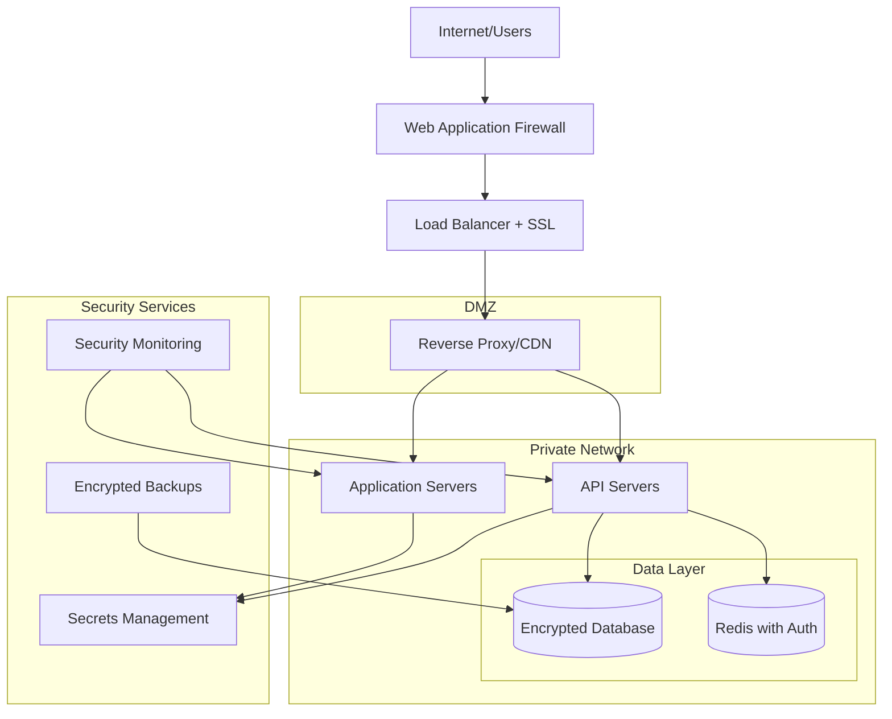

# 🔒 Security Setup Guide

**Gaming Platform - Production Security Configuration**

This document provides comprehensive security setup instructions, best practices, and configuration guidelines for securing the gaming platform in production environments.

## 🛡️ Security Overview

### Security Architecture


### Security Layers
1. **Perimeter Security**: WAF, DDoS protection, rate limiting
2. **Network Security**: Private networks, VPN access, firewall rules
3. **Application Security**: Authentication, authorization, input validation
4. **Data Security**: Encryption at rest and in transit, secure backups
5. **Operational Security**: Monitoring, logging, incident response

## 🌐 Network Security Configuration

### Firewall Rules (iptables/ufw)
```bash
#!/bin/bash
# Basic firewall configuration

# Reset firewall rules
ufw --force reset

# Default policies
ufw default deny incoming
ufw default allow outgoing

# SSH access (change port from default 22)
ufw allow 2222/tcp

# HTTP/HTTPS for web traffic
ufw allow 80/tcp
ufw allow 443/tcp

# Database (only from application servers)
ufw allow from 10.0.1.0/24 to any port 5432
ufw allow from 10.0.1.0/24 to any port 6379

# Internal communication
ufw allow from 10.0.0.0/16 to any port 3000
ufw allow from 10.0.0.0/16 to any port 3001

# Monitoring
ufw allow from 10.0.2.0/24 to any port 9090

# Enable firewall
ufw enable
```

### Security Groups (Cloud)
```yaml
# AWS Security Groups Example
web_servers:
  ingress:
    - port: 80
      protocol: tcp
      source: 0.0.0.0/0
    - port: 443
      protocol: tcp
      source: 0.0.0.0/0
    - port: 22
      protocol: tcp
      source: management_sg
  egress:
    - port: 0-65535
      protocol: tcp
      destination: 0.0.0.0/0

api_servers:
  ingress:
    - port: 3001
      protocol: tcp
      source: web_servers_sg
    - port: 22
      protocol: tcp
      source: management_sg
  egress:
    - port: 5432
      protocol: tcp
      destination: database_sg
    - port: 6379
      protocol: tcp
      destination: redis_sg

database_servers:
  ingress:
    - port: 5432
      protocol: tcp
      source: api_servers_sg
    - port: 22
      protocol: tcp
      source: management_sg
  egress:
    - port: 443
      protocol: tcp
      destination: 0.0.0.0/0
```

## 🔐 SSL/TLS Configuration

### SSL Certificate Setup (Let's Encrypt)
```bash
#!/bin/bash
# Automated SSL certificate setup

# Install Certbot
sudo apt-get update
sudo apt-get install -y certbot python3-certbot-nginx

# Generate certificates
sudo certbot certonly --nginx \
  -d your-domain.com \
  -d www.your-domain.com \
  -d api.your-domain.com \
  --email admin@your-domain.com \
  --agree-tos \
  --non-interactive

# Auto-renewal setup
sudo crontab -e
# Add: 0 12 * * * /usr/bin/certbot renew --quiet
```

### Nginx SSL Configuration
```nginx
# /etc/nginx/sites-available/gaming-platform-ssl
server {
    listen 443 ssl http2;
    server_name your-domain.com www.your-domain.com;

    # SSL Certificate Configuration
    ssl_certificate /etc/letsencrypt/live/your-domain.com/fullchain.pem;
    ssl_certificate_key /etc/letsencrypt/live/your-domain.com/privkey.pem;
    
    # SSL Security Configuration
    ssl_protocols TLSv1.2 TLSv1.3;
    ssl_ciphers ECDHE-RSA-AES256-GCM-SHA512:DHE-RSA-AES256-GCM-SHA512:ECDHE-RSA-AES256-GCM-SHA384:DHE-RSA-AES256-GCM-SHA384;
    ssl_prefer_server_ciphers off;
    ssl_session_cache shared:SSL:10m;
    ssl_session_timeout 10m;
    ssl_session_tickets off;
    
    # OCSP Stapling
    ssl_stapling on;
    ssl_stapling_verify on;
    ssl_trusted_certificate /etc/letsencrypt/live/your-domain.com/chain.pem;
    resolver 8.8.8.8 8.8.4.4 valid=300s;
    resolver_timeout 5s;

    # Security Headers
    add_header Strict-Transport-Security "max-age=63072000; includeSubDomains; preload" always;
    add_header X-Content-Type-Options nosniff always;
    add_header X-Frame-Options SAMEORIGIN always;
    add_header X-XSS-Protection "1; mode=block" always;
    add_header Referrer-Policy "strict-origin-when-cross-origin" always;
    add_header Content-Security-Policy "default-src 'self'; script-src 'self' 'unsafe-inline' https://cdnjs.cloudflare.com; style-src 'self' 'unsafe-inline'; img-src 'self' data: https:; font-src 'self' https://fonts.gstatic.com; connect-src 'self' wss: https:; media-src 'self';" always;
    
    # Additional Security Headers
    add_header X-Permitted-Cross-Domain-Policies none always;
    add_header X-Robots-Tag none always;
    add_header X-Download-Options noopen always;
    add_header X-DNS-Prefetch-Control off always;
    
    # Remove Server Header
    server_tokens off;
    
    # Location blocks continue here...
}

# Redirect HTTP to HTTPS
server {
    listen 80;
    server_name your-domain.com www.your-domain.com;
    return 301 https://$server_name$request_uri;
}
```

## 🛡️ Application Security

### Environment Security
```bash
# .env.production security template
# Use strong, unique secrets for production

# JWT Security (256-bit minimum)
JWT_SECRET=$(openssl rand -hex 64)
JWT_REFRESH_SECRET=$(openssl rand -hex 64)

# Database Security
DATABASE_URL="postgresql://secure_user:$(openssl rand -hex 32)@localhost:5432/gaming_platform?sslmode=require"
DB_SSL_CA=/path/to/ca-certificate.crt
DB_SSL_CERT=/path/to/client-certificate.crt
DB_SSL_KEY=/path/to/client-key.key

# Redis Security
REDIS_PASSWORD=$(openssl rand -hex 32)
REDIS_TLS=true

# Session Security
SESSION_SECRET=$(openssl rand -hex 32)
SESSION_SECURE=true
SESSION_HTTP_ONLY=true
SESSION_SAME_SITE=strict

# Security Features
BCRYPT_ROUNDS=12
RATE_LIMIT_ENABLED=true
CSRF_PROTECTION=true
XSS_PROTECTION=true
```

### Input Validation & Sanitization
```javascript
// Example validation middleware
const { body, validationResult } = require('express-validator');
const DOMPurify = require('isomorphic-dompurify');

// User registration validation
const validateRegistration = [
  body('email')
    .isEmail()
    .normalizeEmail()
    .isLength({ max: 255 })
    .custom(async (email) => {
      const existingUser = await User.findByEmail(email);
      if (existingUser) {
        throw new Error('Email already exists');
      }
    }),
  
  body('username')
    .isAlphanumeric()
    .isLength({ min: 3, max: 30 })
    .custom((username) => {
      // Sanitize username
      return DOMPurify.sanitize(username);
    }),
  
  body('password')
    .isLength({ min: 8, max: 128 })
    .matches(/^(?=.*[a-z])(?=.*[A-Z])(?=.*\d)/)
    .withMessage('Password must contain uppercase, lowercase, and number'),
  
  (req, res, next) => {
    const errors = validationResult(req);
    if (!errors.isEmpty()) {
      return res.status(422).json({
        success: false,
        errors: errors.array()
      });
    }
    next();
  }
];
```

### Rate Limiting Configuration
```javascript
// Advanced rate limiting setup
const rateLimit = require('express-rate-limit');
const RedisStore = require('rate-limit-redis');
const Redis = require('redis');

const redisClient = Redis.createClient(process.env.REDIS_URL);

// General API rate limiting
const generalLimiter = rateLimit({
  store: new RedisStore({
    client: redisClient,
    prefix: 'rl:general:'
  }),
  windowMs: 15 * 60 * 1000, // 15 minutes
  max: 1000, // requests per window
  message: {
    success: false,
    error: {
      code: 'RATE_LIMIT_EXCEEDED',
      message: 'Too many requests, please try again later'
    }
  },
  standardHeaders: true,
  legacyHeaders: false
});

// Authentication rate limiting (stricter)
const authLimiter = rateLimit({
  store: new RedisStore({
    client: redisClient,
    prefix: 'rl:auth:'
  }),
  windowMs: 15 * 60 * 1000,
  max: 5, // only 5 attempts per window
  skipSuccessfulRequests: true,
  message: {
    success: false,
    error: {
      code: 'AUTH_RATE_LIMIT_EXCEEDED',
      message: 'Too many authentication attempts'
    }
  }
});

// Game action rate limiting
const gameLimiter = rateLimit({
  store: new RedisStore({
    client: redisClient,
    prefix: 'rl:game:'
  }),
  windowMs: 60 * 1000, // 1 minute
  max: 100, // game actions per minute
  keyGenerator: (req) => {
    // Rate limit per user for authenticated requests
    return req.user ? `${req.user.id}` : req.ip;
  }
});
```

## 🗄️ Database Security

### PostgreSQL Security Configuration
```sql
-- postgresql.conf security settings
ssl = on
ssl_ca_file = 'ca-certificate.crt'
ssl_cert_file = 'server-certificate.crt' 
ssl_key_file = 'server-key.key'
ssl_ciphers = 'HIGH:MEDIUM:+3DES:!aNULL'
ssl_prefer_server_ciphers = on

-- Connection security
listen_addresses = 'localhost,10.0.1.10'
port = 5432
max_connections = 200

-- Authentication
password_encryption = scram-sha-256
log_connections = on
log_disconnections = on
log_failed_login_attempts = on

-- Auditing
log_statement = 'mod'
log_min_duration_statement = 1000
```

```sql
-- Database user security
-- Create dedicated application user with limited privileges
CREATE USER gaming_app WITH PASSWORD 'secure_generated_password';

-- Grant only necessary permissions
GRANT CONNECT ON DATABASE gaming_platform TO gaming_app;
GRANT USAGE ON SCHEMA public TO gaming_app;
GRANT SELECT, INSERT, UPDATE, DELETE ON ALL TABLES IN SCHEMA public TO gaming_app;
GRANT USAGE, SELECT ON ALL SEQUENCES IN SCHEMA public TO gaming_app;

-- Create read-only user for analytics
CREATE USER gaming_analytics WITH PASSWORD 'secure_analytics_password';
GRANT CONNECT ON DATABASE gaming_platform TO gaming_analytics;
GRANT USAGE ON SCHEMA public TO gaming_analytics;
GRANT SELECT ON ALL TABLES IN SCHEMA public TO gaming_analytics;

-- Remove default public permissions
REVOKE ALL ON SCHEMA public FROM PUBLIC;
```

### Data Encryption
```sql
-- Enable transparent data encryption (if supported)
-- Encrypt sensitive columns
CREATE TABLE users (
    id UUID PRIMARY KEY DEFAULT gen_random_uuid(),
    username VARCHAR(50) UNIQUE NOT NULL,
    email VARCHAR(255) UNIQUE NOT NULL,
    password_hash VARCHAR(255) NOT NULL,
    -- Encrypt PII data
    personal_data BYTEA, -- Encrypted JSON
    created_at TIMESTAMP DEFAULT CURRENT_TIMESTAMP
);

-- Create encryption functions
CREATE OR REPLACE FUNCTION encrypt_pii(data TEXT, key TEXT)
RETURNS BYTEA AS $$
BEGIN
    -- Use pgcrypto extension for encryption
    RETURN pgp_sym_encrypt(data, key);
END;
$$ LANGUAGE plpgsql;

CREATE OR REPLACE FUNCTION decrypt_pii(encrypted_data BYTEA, key TEXT)
RETURNS TEXT AS $$
BEGIN
    RETURN pgp_sym_decrypt(encrypted_data, key);
END;
$$ LANGUAGE plpgsql;
```

### Redis Security Configuration
```conf
# redis.conf security settings
# Bind to specific interfaces only
bind 127.0.0.1 10.0.1.10

# Enable authentication
requirepass your_secure_redis_password

# Disable dangerous commands
rename-command FLUSHDB ""
rename-command FLUSHALL ""
rename-command DEBUG ""
rename-command CONFIG "CONFIG_b83f8d2c1a5e3f7g"

# Enable TLS
port 0
tls-port 6380
tls-cert-file /path/to/redis.crt
tls-key-file /path/to/redis.key
tls-ca-cert-file /path/to/ca.crt
tls-dh-params-file /path/to/redis.dh

# Security settings
protected-mode yes
tcp-keepalive 300
timeout 300

# Logging
loglevel notice
logfile /var/log/redis/redis-server.log
syslog-enabled yes
```

## 🔍 Security Monitoring & Logging

### Security Event Logging
```javascript
// Security event logger
const winston = require('winston');
const DailyRotateFile = require('winston-daily-rotate-file');

const securityLogger = winston.createLogger({
  level: 'info',
  format: winston.format.combine(
    winston.format.timestamp(),
    winston.format.json(),
    winston.format.errors({ stack: true })
  ),
  defaultMeta: { service: 'gaming-platform-security' },
  transports: [
    new DailyRotateFile({
      filename: '/var/log/gaming/security-%DATE%.log',
      datePattern: 'YYYY-MM-DD',
      maxSize: '20m',
      maxFiles: '30d',
      level: 'info'
    }),
    new DailyRotateFile({
      filename: '/var/log/gaming/security-error-%DATE%.log',
      datePattern: 'YYYY-MM-DD',
      maxSize: '20m',
      maxFiles: '30d',
      level: 'error'
    })
  ]
});

// Security event types
const SecurityEvents = {
  LOGIN_SUCCESS: 'login_success',
  LOGIN_FAILURE: 'login_failure',
  PASSWORD_CHANGE: 'password_change',
  SUSPICIOUS_ACTIVITY: 'suspicious_activity',
  RATE_LIMIT_EXCEEDED: 'rate_limit_exceeded',
  UNAUTHORIZED_ACCESS: 'unauthorized_access',
  SQL_INJECTION_ATTEMPT: 'sql_injection_attempt',
  XSS_ATTEMPT: 'xss_attempt',
  LARGE_TRANSACTION: 'large_transaction',
  MULTIPLE_FAILED_GAMES: 'multiple_failed_games'
};

// Log security events
function logSecurityEvent(event, userId, details = {}) {
  securityLogger.info({
    event,
    userId,
    ip: details.ip,
    userAgent: details.userAgent,
    timestamp: new Date().toISOString(),
    details
  });
}
```

### Intrusion Detection
```bash
#!/bin/bash
# Basic intrusion detection script

# Monitor failed SSH attempts
tail -f /var/log/auth.log | grep "Failed password" | while read line; do
    ip=$(echo $line | grep -oE "\b([0-9]{1,3}\.){3}[0-9]{1,3}\b")
    echo "Failed SSH attempt from $ip at $(date)" >> /var/log/intrusion.log
    
    # Block IP after 5 failed attempts
    failed_count=$(grep -c "$ip" /var/log/intrusion.log)
    if [ $failed_count -ge 5 ]; then
        iptables -A INPUT -s $ip -j DROP
        echo "Blocked IP $ip due to repeated failures" >> /var/log/intrusion.log
    fi
done &

# Monitor unusual database connections
tail -f /var/log/postgresql/postgresql.log | grep "FATAL" | while read line; do
    echo "Database connection failure: $line" >> /var/log/intrusion.log
done &

# Monitor application errors for potential attacks
tail -f /var/log/gaming/error.log | grep -i "sql\|script\|eval\|exec" | while read line; do
    echo "Potential attack detected: $line" >> /var/log/intrusion.log
done &
```

## 🚨 Incident Response

### Automated Response System
```javascript
// Automated security response
const SecurityResponse = {
  async handleSuspiciousActivity(userId, event, severity = 'medium') {
    const actions = [];
    
    switch (severity) {
      case 'high':
        // Immediate account suspension
        await UserService.suspendAccount(userId);
        actions.push('account_suspended');
        
        // Notify administrators immediately
        await NotificationService.sendUrgentAlert({
          type: 'security_incident',
          userId,
          event,
          severity
        });
        actions.push('admin_notified');
        
        // Force logout from all sessions
        await SessionService.invalidateAllSessions(userId);
        actions.push('sessions_invalidated');
        break;
        
      case 'medium':
        // Require re-authentication
        await SessionService.requireReauth(userId);
        actions.push('reauth_required');
        
        // Increase monitoring
        await SecurityService.increaseUserMonitoring(userId);
        actions.push('monitoring_increased');
        break;
        
      case 'low':
        // Log event for review
        await SecurityService.logForReview(userId, event);
        actions.push('logged_for_review');
        break;
    }
    
    return actions;
  },
  
  async handleRateLimitExceeded(ip, endpoint) {
    // Temporary IP ban
    await FirewallService.blockIP(ip, '1 hour');
    
    // Log incident
    logSecurityEvent(SecurityEvents.RATE_LIMIT_EXCEEDED, null, {
      ip,
      endpoint,
      action: 'ip_blocked_1h'
    });
  }
};
```

### Security Checklist Scripts
```bash
#!/bin/bash
# security-audit.sh - Daily security audit script

echo "🔒 Starting daily security audit..."

# Check for failed login attempts
echo "Checking failed login attempts..."
failed_logins=$(grep "Failed password" /var/log/auth.log | wc -l)
if [ $failed_logins -gt 100 ]; then
    echo "⚠️  WARNING: $failed_logins failed login attempts detected"
fi

# Check SSL certificate expiry
echo "Checking SSL certificate expiry..."
expiry_date=$(openssl x509 -enddate -noout -in /etc/letsencrypt/live/your-domain.com/fullchain.pem | cut -d= -f2)
expiry_timestamp=$(date -d "$expiry_date" +%s)
current_timestamp=$(date +%s)
days_until_expiry=$(( (expiry_timestamp - current_timestamp) / 86400 ))

if [ $days_until_expiry -lt 30 ]; then
    echo "⚠️  WARNING: SSL certificate expires in $days_until_expiry days"
fi

# Check for suspicious database queries
echo "Checking database logs for suspicious activity..."
suspicious_queries=$(grep -i "drop\|delete\|insert\|update" /var/log/postgresql/postgresql.log | grep -v "expected_app_user" | wc -l)
if [ $suspicious_queries -gt 0 ]; then
    echo "⚠️  WARNING: $suspicious_queries suspicious database queries detected"
fi

# Check disk usage for log files
echo "Checking log disk usage..."
log_usage=$(df /var/log | tail -1 | awk '{print $5}' | sed 's/%//')
if [ $log_usage -gt 80 ]; then
    echo "⚠️  WARNING: Log partition is ${log_usage}% full"
fi

# Check for updates
echo "Checking for security updates..."
updates=$(apt list --upgradable 2>/dev/null | grep -i security | wc -l)
if [ $updates -gt 0 ]; then
    echo "ℹ️  INFO: $updates security updates available"
fi

echo "✅ Security audit completed"
```

## 📋 Security Hardening Checklist

### System Level Security
- [ ] Server hardening (disable unused services, remove default accounts)
- [ ] SSH key-based authentication only (disable password login)
- [ ] Firewall properly configured and tested
- [ ] Automatic security updates enabled
- [ ] Intrusion detection system installed and configured
- [ ] Log rotation and retention policies configured
- [ ] Time synchronization (NTP) configured
- [ ] File integrity monitoring enabled

### Application Level Security
- [ ] All dependencies updated to latest secure versions
- [ ] Input validation implemented for all user inputs
- [ ] Output encoding/escaping implemented
- [ ] SQL injection protection verified
- [ ] XSS protection implemented
- [ ] CSRF protection enabled
- [ ] Rate limiting configured and tested
- [ ] Security headers configured
- [ ] Error handling doesn't leak sensitive information
- [ ] File upload security implemented

### Database Security
- [ ] Database server hardened (remove default accounts, disable unused features)
- [ ] Strong authentication credentials
- [ ] Network access restricted to application servers only
- [ ] SSL/TLS encryption enabled
- [ ] Query logging enabled for suspicious activity
- [ ] Regular security updates applied
- [ ] Data encryption at rest enabled
- [ ] Backup encryption enabled

### Infrastructure Security
- [ ] SSL/TLS certificates installed and configured
- [ ] Certificate auto-renewal configured
- [ ] Load balancer security configured
- [ ] CDN security features enabled
- [ ] DNS security (DNSSEC) enabled
- [ ] DDoS protection enabled
- [ ] Web Application Firewall (WAF) configured

### Operational Security
- [ ] Security monitoring and alerting configured
- [ ] Incident response procedures documented
- [ ] Regular security audits scheduled
- [ ] Penetration testing completed
- [ ] Security training for team members
- [ ] Backup and disaster recovery procedures tested
- [ ] Compliance requirements verified

---

**Next Steps:**
- Configure [Security Monitoring](./monitoring.md)
- Review [Compliance Guide](./compliance.md)
- Set up [Monitoring & Analytics](../monitoring/setup.md)
- Test [Incident Response Procedures](./incident-response.md)